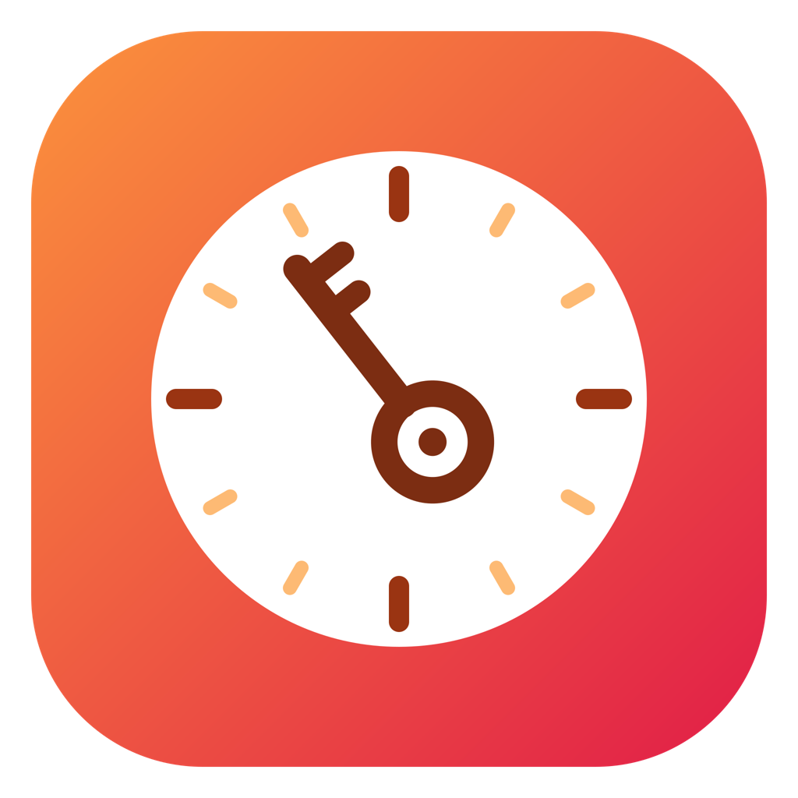
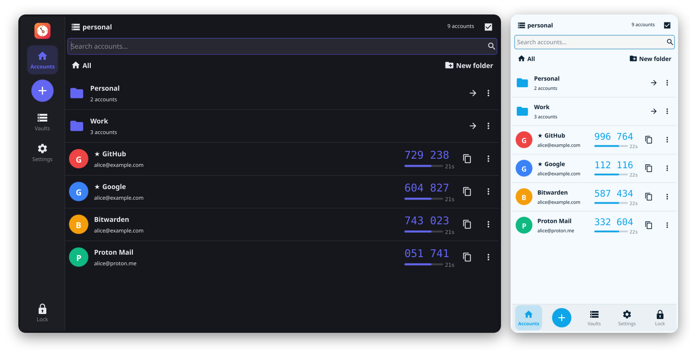
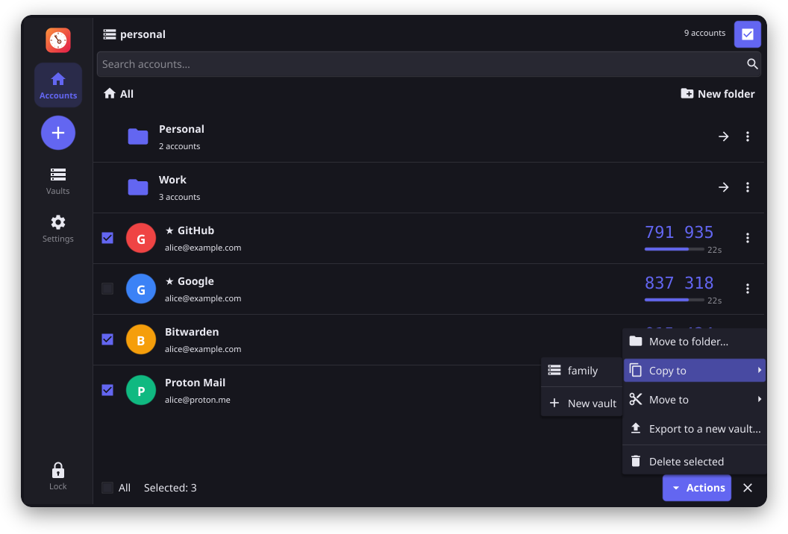
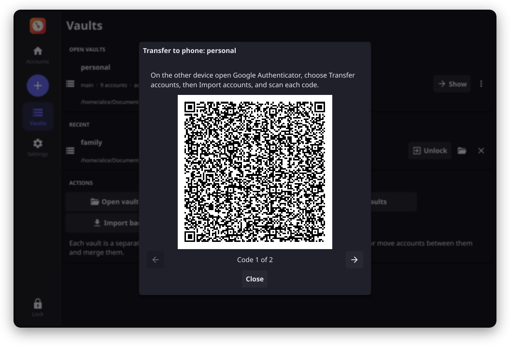
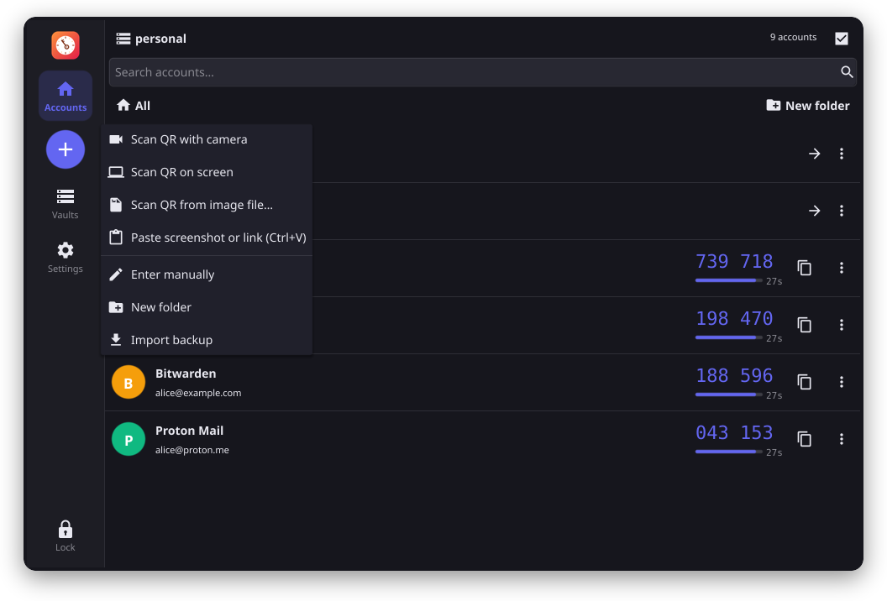
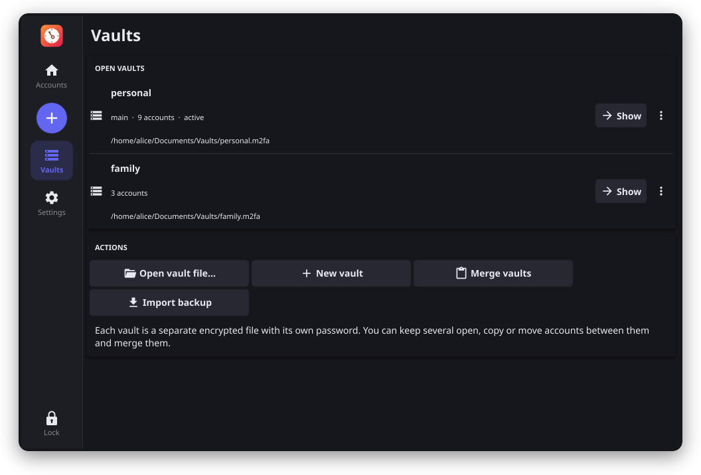
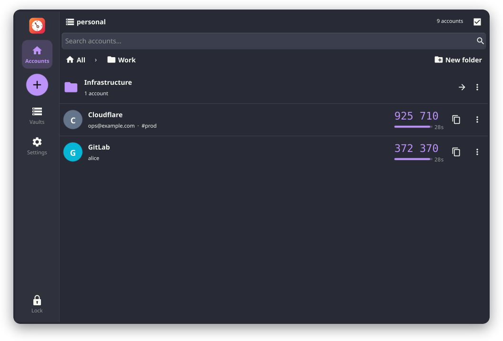
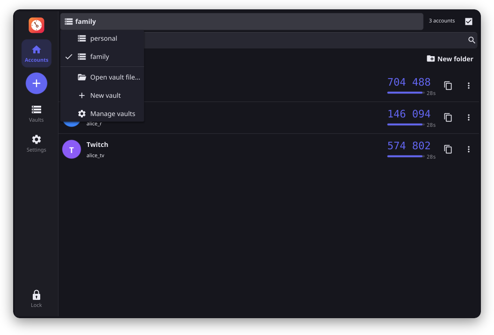
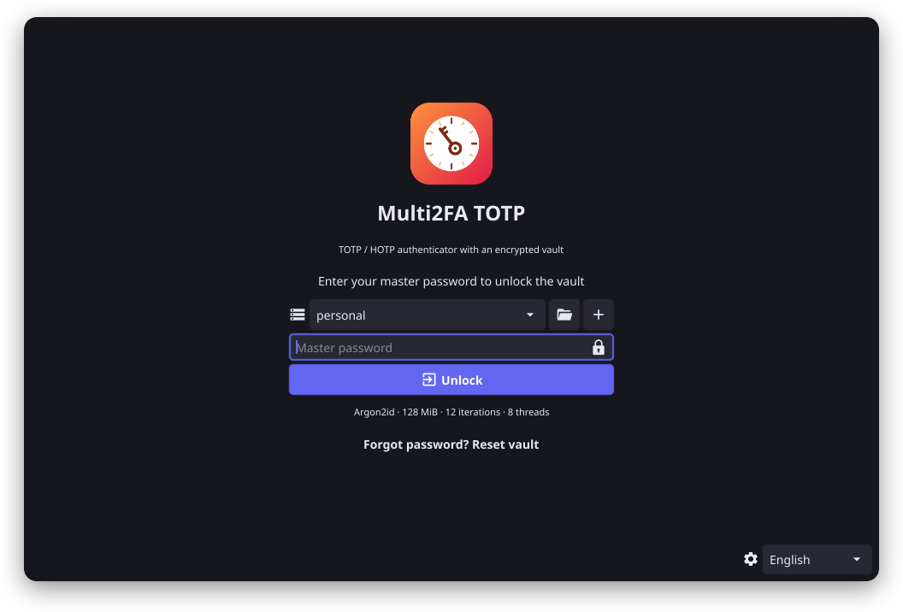
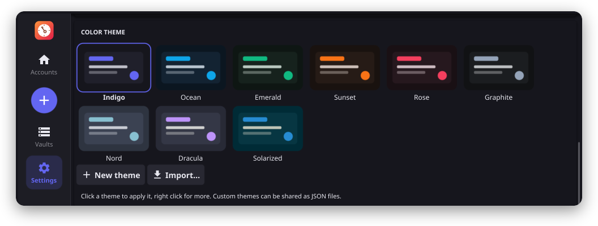

<div align="center">



# Multi2FA TOTP

**A fast, offline two-factor authenticator for your desktop, your phone and your terminal.**<br>
Codes live in encrypted vaults that never leave your device.

[](https://github.com/keklick1337/Multi2FA-TOTP/releases/latest)
[](https://github.com/keklick1337/Multi2FA-TOTP/actions/workflows/ci.yml)
[](LICENSE)
[](go.mod)
<br>


[Why](#tired-of-google-authenticator) · [Download](#download) · [Tour](#tour) · [Features](#features) · [Command line](#command-line) · [Security](#security) · [Building](#building)



</div>

## Tired of Google Authenticator?

Your codes are stuck on one phone. A new phone means re-scanning a pile of QR codes, a lost phone means a dozen
"I can't log in" support tickets, and there is no way to see a code on the computer you are actually logging in on.

**Multi2FA TOTP is the open source alternative that treats your 2FA accounts like your own data:**

- **On every device.** Linux, Windows, macOS, Android, plus a command line tool. Codes are on the screen you are logging
  in on, copied with one click.
- **Move, copy and split accounts freely.** Tick a few accounts and copy or move them to another vault, export them
  into a new encrypted file for a colleague, or merge two vaults. Folders of any depth keep hundreds of accounts tidy.
- **Backups you own.** A vault is one encrypted file: put it on a USB stick, in your cloud folder or in a password
  manager. No account, no cloud lock-in, no telemetry.
- **Serious crypto.** Argon2id, scrypt or PBKDF2 feeding XChaCha20-Poly1305, AES-256-GCM or both in cascade, an optional
  KeePass style key file, and secrets that stay encrypted even in RAM.
- **No lock-in either way.** Imports Google Authenticator exports in one scan and can export back to Google
  Authenticator (or any app that reads `otpauth://` links) whenever you like.

| | Multi2FA TOTP | Google Authenticator |
| --- | :---: | :---: |
| Open source | ✅ MIT | ❌ |
| Desktop app (Linux, Windows, macOS) | ✅ | ❌ phone only |
| Command line tool for scripts | ✅ | ❌ |
| Several separate vaults, each with its own password | ✅ | ❌ |
| Folders, nested to any depth | ✅ | ❌ |
| Copy or move single accounts between vaults | ✅ | ❌ |
| Encrypted backup file that you keep | ✅ | ❌ Google account sync or QR transfer only |
| Works fully offline, without any account | ✅ | ✅ |
| Scan QR codes from the screen, an image or the clipboard | ✅ | ❌ camera only |
| Import from Google Authenticator / export back to it | ✅ / ✅ | n/a |
| Selectable KDF and cipher, optional key file | ✅ | ❌ |
| Color themes and dark/light mode | ✅ 9 themes + your own | dark/light |

<sub>Compared with the Google Authenticator apps for Android and iOS as of 2026. Google Authenticator is a trademark of
Google LLC; this project is not affiliated with Google.</sub>

### Switch in a minute

1. In Google Authenticator open the menu → **Transfer accounts** → **Export accounts** and pick the accounts. It shows
   one or more QR codes.
2. In Multi2FA press **+** → **Scan QR with camera** and hold the phone up to your webcam. No webcam? Photograph the QR
   code with another phone and use **Scan QR from image file** or paste the picture with `Ctrl+V`.
3. Done: issuers, account names, algorithms and digits come over as they are. Repeat for each QR code.

Going the other way is just as easy: on the Vaults page, open a vault's menu → **Transfer to phone** shows QR codes that
Google Authenticator (and most other authenticator apps) can import.

## Tour

<table>
<tr>
<td width="50%"></td>
<td width="50%"></td>
</tr>
<tr>
<td align="center"><b>Copy or move</b> ticked accounts to another vault, a folder or a new file</td>
<td align="center"><b>Transfer to a phone</b> with Google Authenticator compatible QR codes</td>
</tr>
<tr>
<td></td>
<td></td>
</tr>
<tr>
<td align="center"><b>Add accounts</b> from a camera, the screen, an image, the clipboard or by hand</td>
<td align="center"><b>Several vaults</b> open side by side, each with its own password</td>
</tr>
<tr>
<td></td>
<td></td>
</tr>
<tr>
<td align="center"><b>Folders</b> of any depth, tags and favorites (Dracula theme)</td>
<td align="center"><b>Switch vaults</b> from the header in one click</td>
</tr>
<tr>
<td></td>
<td></td>
</tr>
<tr>
<td align="center"><b>Unlock</b> with a master password and an optional key file</td>
<td align="center"><b>Themes</b>: 9 built in, or design your own</td>
</tr>
</table>

## Download

Grab the files for your system from the [latest release](https://github.com/keklick1337/Multi2FA-TOTP/releases/latest)
(`<v>` is the version). `SHA256SUMS` lists the checksums of every file.

| System | File |
| --- | --- |
| Debian 11, Ubuntu 20.04/22.04, Mint 20/21 | `multi2fa-totp_<v>-1~deb11_<arch>.deb` |
| Debian 12, Ubuntu 24.04+, Mint 22 | `multi2fa-totp_<v>-1~deb12_<arch>.deb` |
| Debian 13 | `multi2fa-totp_<v>-1~deb13_<arch>.deb` |
| RHEL, AlmaLinux, Rocky, Oracle Linux 8 / 9 / 10 | `multi2fa-totp-<v>-1.el8/el9/el10.<arch>.rpm` |
| Fedora 42 / 43 / 44 | `multi2fa-totp-<v>-1.fc42/fc43/fc44.<arch>.rpm` |
| openSUSE Leap 15.6 | `multi2fa-totp-<v>-1.lp156.<arch>.rpm` |
| Any other Linux (glibc 2.31+) | `Multi2FA-TOTP-<v>-linux-<arch>.tar.gz` |
| Windows 10/11 | `Multi2FA-TOTP-<v>-windows-amd64-setup.exe` (installer) or `-windows-amd64.zip` (portable) |
| Windows 11 on ARM | `Multi2FA-TOTP-<v>-windows-arm64-setup.exe` or `-windows-arm64.zip` |
| macOS 11+ (Intel and Apple Silicon) | `Multi2FA-TOTP-<v>-macos-universal.dmg` or `.zip` |
| Android 5.0+ | `Multi2FA-TOTP-<v>-android-universal.apk` (or `-arm64-v8a.apk`, smaller) |
| Command line only: Debian, Ubuntu | `multi2fa-cli_<v>-1_<arch>.deb` |
| Command line only: Fedora, RHEL, openSUSE | `multi2fa-cli-<v>-1.<arch>.rpm` |
| Command line only: Arch Linux | `multi2fa-cli-<v>-1-<arch>.pkg.tar.zst` |
| Command line only: anything else | `Multi2FA-TOTP-cli-<v>-<os>-<arch>.tar.gz` |

Linux architectures of the app: `.deb` and the portable archive come for `amd64`, `arm64` and `armhf` (Raspberry Pi OS
included), `.rpm` packages for `x86_64` and `aarch64`. The CLI is a static binary: its packages fit every release of
a distribution and exist for x86_64, i386, arm64, armv7, riscv64, ppc64le, s390x and loong64 (plus mips64el for Debian). The desktop packages already contain `multi2fa-cli`, so install one or the other.

<details>
<summary><b>Installation details</b></summary>

#### Debian, Ubuntu, Mint

```sh
sudo apt install ./multi2fa-totp_<v>-1~deb12_amd64.deb
```

#### Fedora, RHEL, AlmaLinux, Rocky, openSUSE

```sh
sudo dnf install ./multi2fa-totp-<v>-1.fc44.x86_64.rpm      # Fedora / EL
sudo zypper install ./multi2fa-totp-<v>-1.lp156.x86_64.rpm  # openSUSE
```

**Portable archive**: unpack it and run `./multi2fa`, or `./install.sh` for a menu entry, icons and the file
association (`~/.local` for your user, `/usr/local` with `sudo`); `./uninstall.sh` removes it again. The portable
build uses X11 and runs on Wayland desktops through XWayland.

**Windows**: run the `-setup.exe` installer. It installs into Program Files with a Start menu entry and an uninstaller
and optionally adds a desktop shortcut, opens `.m2fa`/`.m2fab` files with the app and puts `multi2fa-cli` on `PATH`.
Silent install: `Multi2FA-TOTP-<v>-windows-amd64-setup.exe /S`. The `.zip` is the portable variant: unpack it and start
`Multi2FA-TOTP.exe` (Settings → "Associate files" registers the file types for your user).

**macOS**: the app is not notarized yet. Open it the first time with right click → Open, or run
`xattr -dr com.apple.quarantine "/Applications/Multi2FA TOTP.app"`.

**Android**: install the APK (allow installs from your browser or file manager when asked).

**Camera scanning** needs `ffmpeg` in `PATH` (the Linux packages recommend it). On Windows put `ffmpeg.exe` next to
the exe or into `ffmpeg\bin\`.

</details>

## Features

#### Accounts

- Add from a camera, a QR code anywhere on the screen, `Ctrl+V` with a screenshot or a link, an image file (or drop
  it onto the window) or by hand.
- `otpauth://totp` and `otpauth://hotp` links with SHA1, SHA256 and SHA512, 6 to 8 digits, any period; Google
  Authenticator exports (`otpauth-migration://`).
- Issuer, account, notes, tags and favorites. Codes can stay hidden until clicked.
- Search across every folder: start typing anywhere, `Enter` copies the first code, `Backspace` in an empty search goes
  one folder up.

#### Organizing

- Several vaults open at the same time, each with its own file, password and optional key file.
- Folders of any depth with breadcrumbs. Drag accounts and folders onto a folder or a breadcrumb; ticked accounts move
  together.
- Selection mode: move to a folder, copy or move to another vault, export to a new vault, delete.
- Merge vaults, import backups; folders are kept and duplicates skipped.

#### Moving to another device

- Encrypted `.m2fab` backups with their own password.
- Key, link and QR code of a single account; transfer QR codes for Google Authenticator.

#### Everyday comfort

- Auto-lock after 1 to 60 minutes, lock when the window loses focus, instant lock button, clipboard clearing.
- System tray with Show / Lock now / Quit and optional "keep running in the tray".
- Navigation rail on wide windows and a bottom bar on narrow ones; light, dark or system mode.
- Native file dialogs (XDG portal on Linux), "Show in folder", "Locate…" for moved vaults, `.m2fa`/`.m2fab` file
  association, `multi2fa <file>` from the command line.
- 6 languages: English, Русский, Українська, Deutsch, Español, Français.

**Theme manager**: 9 built-in color themes (Indigo, Ocean, Emerald, Sunset, Rose, Graphite, Nord, Dracula, Solarized),
each with dark and light variants. Make your own with the color editor and live preview, and share them as JSON.

## Command line

`multi2fa-cli` opens the same vaults from a terminal. It is a single static binary, included in every desktop package
and available on its own as `.deb`, `.rpm` and Arch packages and as `.tar.gz` for 36 OS/CPU targets: Linux
(x86, ARM, RISC-V, POWER, s390x, LoongArch, MIPS), Windows, macOS, FreeBSD, OpenBSD, NetBSD, illumos, Solaris and AIX.

```console
$ multi2fa-cli codes
Master password:
#  ISSUER       ACCOUNT            CODE     LEFT  FOLDER
1  GitHub       alice@example.com  219 626  18s
2  Google       alice@example.com  107 542  18s
3  AWS          root@example.com   187 148  18s   Work/Infrastructure
5  Cloudflare   ops@example.com    892 622  18s   Work

$ multi2fa-cli code github          # only the code, for scripts
219626
$ multi2fa-cli code github -copy    # straight to the clipboard
$ pass show multi2fa | multi2fa-cli -password-stdin codes -json
```

`list`, `code`, `codes -watch`, `add` (links, QR images, manual), `remove`, `export` (links, terminal QR codes, Google
Authenticator transfer), `backup`, `import`, `passwd`, `info`. Full reference: [docs/cli.md](docs/cli.md).

## Security

### Vault file

- The password and optional key file form a composite key `SHA-256(SHA-256(password) || SHA-256(key file))`, as in
  KeePass/KeePassXC, which goes through a key derivation function of your choice:

  | Key derivation | Parameters |
  | --- | --- |
  | Argon2id (default) | iterations, memory, parallelism |
  | scrypt | cost N = 2^x, block size r, parallelism p |
  | PBKDF2-HMAC-SHA512 | iterations |

- Presets calibrate the work factor on your machine for a target unlock time; "Custom" takes exact parameters and
  "Test speed" measures them:

  | Level | Unlock time | Argon2id memory |
  | --- | --- | --- |
  | Fast | ~0.5 s | 128 MiB |
  | Balanced (default) | ~1 s | 256 MiB |
  | Strong | ~2 s | 512 MiB |
  | Paranoid | ~5 s | 1 GiB |

- Encryption: XChaCha20-Poly1305 (default), AES-256-GCM, or AES-256-GCM inside XChaCha20-Poly1305 with independent
  keys. Every mode uses its own subkey derived with HKDF-SHA256.
- The cipher is not recorded in the file: on opening every mode is tried and the authentication tag identifies the
  right one. The header (KDF parameters, salt, flags) is authenticated and padding hides the data size.
- Password, key file, cipher and key derivation can be changed at any time (Settings → Change master password).
- Atomic writes with a `.bak` copy.

### Process memory

- The master key exists only inside memguard enclaves (encrypted in RAM, `mlock`, guard pages).
- Every OTP secret stays encrypted in memory with a session key and is decrypted into locked memory only while a code
  is computed; the HMAC is calculated with its key pads in locked memory and wiped afterwards.
- Passwords are typed into a field that keeps them in locked memory instead of Go strings.
- Linux: the process is not dumpable and other processes of the same user cannot attach a debugger or read
  `/proc/<pid>/mem`. macOS: debugger attachment is denied. Core dumps are disabled.
- Locking closes every vault, destroys the keys and returns the freed memory to the OS.

Limits worth knowing: while a vault is unlocked the process must be able to compute codes, so root/administrator or
kernel level malware can in principle extract data. Text you reveal yourself ("Show secret / QR") or paste from the
clipboard passes through ordinary memory. The protection makes attacks much harder but does not replace a clean
system. Found a vulnerability? See [SECURITY.md](SECURITY.md).

## Data

| OS | Default vault |
| --- | --- |
| Linux, BSD | `~/.config/Multi2FA/vault.m2fa` |
| macOS | `~/Library/Application Support/Multi2FA/vault.m2fa` |
| Windows | `%AppData%\Multi2FA\vault.m2fa` |
| Android / iOS | app private storage |

Additional vaults can live anywhere. Override the default with `multi2fa -vault <file>` or `MULTI2FA_VAULT`. Security
settings are stored encrypted in the main vault; language, theme, the recent vault list and the key file path (not the
file itself) are kept in the regular application preferences.

## Building

Requirements: Go 1.26+ and a C compiler (Fyne uses cgo and OpenGL). Release packages only need Docker. `make help`
lists every target.

| Command | Result |
| --- | --- |
| `make` | vet + tests + package for this OS |
| `make build` / `make run` | quick binary `build/multi2fa` / build and start |
| `make cli` | `build/multi2fa-cli`; pure Go, so `GOOS=… GOARCH=… make cli` cross compiles |
| `make linux` | `build/linux/Multi2FA-TOTP-<v>-linux-<arch>/` + `.tar.gz` |
| `make windows` | Windows `.exe` with icon and version info (mingw-w64 when run on Linux; `WIN_ARCH=arm64` for ARM) |
| `make darwin` | `build/darwin/Multi2FA TOTP.app` (universal) + `.zip` + `.dmg`, run on macOS |
| `make darwin-cross` | the same `.app` + `.zip` built on Linux in Docker, needs a macOS SDK (see below) |
| `make android` | Android `.aab` + APKs signed with a local development key, via Docker |
| `make ios` / `make ios-simulator` | iOS app, run on macOS with Xcode |
| `make release` | every package below, in parallel, into one flat folder `build/release/` |
| `make icons` | regenerate all icons from `assets/icon.svg` (needs `rsvg-convert`) |
| `make bump-patch` | bump the version (`bump-minor`, `bump-major`); the version lives in `VERSION` |

Windows without make: `build.bat` (needs GCC, e.g. MSYS2 `pacman -S mingw-w64-ucrt-x86_64-gcc`).

### `make release`

Builds everything in Docker containers and puts every file, plus `SHA256SUMS`, directly into `build/release/`:

| Package | Built on | Architectures |
| --- | --- | --- |
| Portable Linux `.tar.gz` | Debian 11 (glibc 2.31, X11) | amd64, arm64, armhf |
| `.deb` | Debian 11, 12, 13 | amd64, arm64, armhf |
| `.rpm` | AlmaLinux 8, 9, 10; Fedora 42, 43, 44; openSUSE Leap 15.6 | x86_64, aarch64 |
| Windows `-setup.exe` (NSIS) + portable `.zip`, app + CLI | Debian 12 + mingw-w64 / llvm-mingw | amd64, arm64 |
| macOS `.app` in `.zip`, ad-hoc signed | fyne-cross darwin image (zig) + your macOS SDK | universal (x86_64 + arm64) |
| `multi2fa-cli` `.tar.gz` | Debian 12, pure Go | 36 targets: Linux amd64/386/arm64/armv7/armv6/riscv64/ppc64le/ppc64/s390x/loong64/mips/mipsle/mips64/mips64le, Windows amd64/386/arm64, macOS amd64/arm64, FreeBSD, OpenBSD, NetBSD (amd64/386/arm64/armv7, OpenBSD also ppc64/riscv64), illumos, Solaris, AIX |
| `multi2fa-cli` packages | Debian 12 + nfpm | `.deb`, `.rpm`, Arch `.pkg.tar.zst` for the Linux CPUs listed under [Download](#download) |
| Android `.aab` + APKs | fyne-cross Android image | arm64-v8a, armeabi-v7a, x86_64, x86 (release key with `KEYSTORE_PASS`, otherwise the development key) |

Other CPUs are cross compiled (Debian multiarch, RPM sysroots with clang + lld), so no emulation is needed.
`RELEASE_JOBS` sets the parallelism (default 6). Parts can be built alone: `release-portable`, `release-deb`,
`release-rpm`, `release-windows`, `release-cli`, `release-android`, or single jobs such as
`make deb@debian_12@arm64` and `make rpm@fedora_44@aarch64`. Distribution and architecture lists sit at the top of the
release section in the `Makefile`.

There is no fully static Linux build of a GUI app: the OpenGL driver always comes from the system. That is why the
portable archive targets the oldest supported glibc and native packages exist for each distribution. The CLI has no
such limits and is fully static. `CLI_TARGETS` in the `Makefile` lists its platforms; the package formats and CPUs are
set at the top of `packaging/docker/build-cli.sh`.

### macOS from Linux

The GUI links against Apple's frameworks, so building it needs the macOS SDK, which Apple only distributes with Xcode
and the Command Line Tools under their license terms; it is not part of this repository. Copy it once from a Mac:

```sh
# on the Mac (Command Line Tools: xcode-select --install)
tar -C "$(xcrun --sdk macosx --show-sdk-path)/.." -cJhf MacOSX.sdk.tar.xz "$(basename "$(xcrun --sdk macosx --show-sdk-path)")"
```

Put the `.sdk` folder or the tarball into `macos-sdk/` (ignored by git) or pass `MACOS_SDK=<path>`. `make release` then
also builds `Multi2FA-TOTP-<v>-macos-universal.zip`; without an SDK the macOS part is skipped with a note. The build
uses the fyne-cross darwin image (zig as the C compiler), joins both architectures with `makefat` and signs the bundle
ad-hoc with `rcodesign`. `make darwin-cross` does the same into `build/darwin/`.

The GitHub Actions workflow (`.github/workflows/release.yml`) builds macOS on a Mac runner instead (with a `.dmg`) on
every `v*` tag, together with all of the above, and attaches everything to the GitHub release.

### Continuous integration

GitHub Actions does everything on GitHub's machines, free of charge for public repositories:

| Workflow | When | What |
| --- | --- | --- |
| `ci.yml` | every push and pull request | `gofmt`, `go vet` and the tests on Linux, Windows and macOS, cross compiled CLI |
| `release.yml` | every push to `main` | the full build (Linux, Windows, macOS, Android, CLI); files under **Artifacts** on the run page |
| `release.yml` | a `v*` tag | the same, published as a GitHub release with `SHA256SUMS` and notes from `CHANGELOG.md` |

Dependabot (`.github/dependabot.yml`) checks once a month and opens at most one pull request for Go modules and one
for GitHub Actions, each bundling all updates.

### Android and iOS

Android builds run in Docker (`fyneio/fyne-cross-images:android`: SDK, NDK, bundletool) through
`packaging/android/build.sh` and produce:

| File | Use |
| --- | --- |
| `Multi2FA-TOTP-<v>-android.aab` | Google Play upload (App Bundle, all ABIs) |
| `Multi2FA-TOTP-<v>-android-universal.apk` | direct install on any device: arm64-v8a, armeabi-v7a, x86_64, x86 |
| `Multi2FA-TOTP-<v>-android-arm64-v8a.apk` | smaller APK for modern phones |

Everything targets API 36 (minimum Android 5.0), is not debuggable, requests no permissions and has backups disabled.

- `make android` signs with a development key created automatically in `keystore/development.keystore`. Good for
  testing; Google Play will not accept it. `make release` uses the same key when no release key is configured and
  prints a warning: installs signed with it cannot be updated by later builds signed with the release key.
- Release signing:
  1. `make android-keystore` creates `keystore/multi2fa-release.keystore` (RSA 4096; keytool asks for the passwords
     and your name). **Back it up together with the passwords**: every update must be signed with the same key.
     `keystore/` is ignored by git.
  2. `make android-release KEYSTORE_PASS=… [KEY_PASS=…] [KEY_ALIAS=multi2fa] BUILD=<versionCode>` writes the files to
     `build/android-release/`; `make release KEYSTORE_PASS=…` includes them in `build/release/`. `BUILD` is the
     Android versionCode and must grow with every upload.
  3. For Google Play enable Play App Signing and upload the `.aab`; your key then acts as the upload key. The APKs are
     signed with your key directly and can be published on GitHub or F-Droid style repositories.
- CI signs releases when the repository secrets `ANDROID_KEYSTORE_B64` (`base64 -w0 keystore/multi2fa-release.keystore`),
  `ANDROID_KEYSTORE_PASS` and optionally `ANDROID_KEY_PASS` and `ANDROID_KEY_ALIAS` are set.

iOS: `make ios` (device, needs a provisioning profile), `make ios-simulator` and `make ios-release` run on macOS with
Xcode. On phones the camera and screen scanners are not available (they rely on desktop tools); accounts are added by
hand, from an image in the gallery or from a copied `otpauth://` link.

### Project layout

```text
cmd/multi2fa        desktop and mobile app
cmd/multi2fa-cli    command line tool
internal/otp        TOTP/HOTP (RFC 6238/4226), otpauth URI, otpauth-migration
internal/vault      file format, KDF, encryption, folders, in-memory secret protection
internal/harden     process hardening (dumpable, ptrace, core dumps)
internal/qr         QR decoding and encoding
internal/capture    clipboard, screenshots, camera via ffmpeg
internal/i18n       translations with plural forms
internal/ui         user interface
assets/             icons (svg, png, ico, icns, hicolor); assets/concepts: logo ideas
packaging/          desktop entry, metainfo, install scripts, Dockerfiles, RPM spec, CLI nfpm config, Android manifest
docs/               CLI manual and screenshots
```

## Contributing

Bug reports, translations and pull requests are welcome; see [CONTRIBUTING.md](CONTRIBUTING.md). Please report security
issues privately as described in [SECURITY.md](SECURITY.md).

## License

[MIT](LICENSE) © keklick1337
